# 🔐 Environment Variables Setup Guide

This guide covers all environment variables needed for your 2025 Success Blueprint application.

---

## 📋 Required Environment Variables

Your application requires the following environment variables to function properly:

| Variable Name | Required | Description | Where to Get It |
|--------------|----------|-------------|-----------------|
| `LEMON_SQUEEZY_API_KEY` | ✅ Yes | API key for payment verification | Lemon Squeezy → Settings → API |
| `LEMON_SQUEEZY_WEBHOOK_SECRET` | ✅ Yes | Webhook signing secret | Lemon Squeezy → Settings → Webhooks |

---

## 🔧 Setup Instructions

### For Local Development

1. **Create `.env` file** in your project root:
   ```bash
   touch .env
   ```

2. **Add environment variables** (copy from `.env.example`):
   ```bash
   cp .env.example .env
   ```

3. **Edit `.env` file** and add your values:
   ```env
   # Lemon Squeezy Configuration
   LEMON_SQUEEZY_API_KEY=lemon_sk_your_actual_api_key_here
   LEMON_SQUEEZY_WEBHOOK_SECRET=whsec_your_webhook_secret_here
   ```

4. **Never commit `.env` to Git**:
   - The `.env` file is already in `.gitignore`
   - Never share these secrets publicly

### For Production (Vercel)

1. **Access Vercel Dashboard**:
   - Go to https://vercel.com/dashboard
   - Select your project
   - Navigate to **Settings → Environment Variables**

2. **Add each variable**:
   
   **Variable 1: LEMON_SQUEEZY_API_KEY**
   - Name: `LEMON_SQUEEZY_API_KEY`
   - Value: `lemon_sk_...` (your actual API key)
   - Environments: ✅ Production, ✅ Preview, ✅ Development
   - Click **Save**

   **Variable 2: LEMON_SQUEEZY_WEBHOOK_SECRET**
   - Name: `LEMON_SQUEEZY_WEBHOOK_SECRET`
   - Value: `whsec_...` (your webhook secret)
   - Environments: ✅ Production, ✅ Preview, ✅ Development
   - Click **Save**

3. **Redeploy your application**:
   ```bash
   vercel --prod
   ```

   Or click **"Redeploy"** in the Vercel dashboard.

---

## 🔍 How to Get Each Value

### LEMON_SQUEEZY_API_KEY

**Step-by-step:**

1. Log into Lemon Squeezy: https://app.lemonsqueezy.com
2. Click your profile (top-right corner)
3. Select **"Settings"**
4. Click **"API"** in left sidebar
5. Click **"+ Create API Key"**
6. Name it: `Production API Key` or `Dev API Key`
7. Click **"Create"**
8. **Copy the key immediately** (starts with `lemon_sk_`)
   ```
   lemon_sk_1234567890abcdefghijklmnopqrstuvwxyz
   ```
9. ⚠️ **You can't view it again!** Save it securely.

**Format:**
```
lemon_sk_[alphanumeric_string]
```

**Where it's used:**
- `api/verify-payment.ts` - To verify payment with Lemon Squeezy API
- Makes API calls to check if a checkout was successful

---

### LEMON_SQUEEZY_WEBHOOK_SECRET

**Step-by-step:**

1. Log into Lemon Squeezy: https://app.lemonsqueezy.com
2. Click your profile → **"Settings"**
3. Click **"Webhooks"** in left sidebar
4. Click **"+ Create Webhook"** (or edit existing)
5. Set webhook URL:
   ```
   https://your-domain.vercel.app/api/lemon-webhook
   ```
6. Select events:
   - ✅ `order_created`
   - ✅ `subscription_created`
7. Click **"Create"**
8. **Copy the "Signing Secret"** (starts with `whsec_`)
   ```
   whsec_abcdef1234567890xyz
   ```

**Format:**
```
whsec_[alphanumeric_string]
```

**Where it's used:**
- `api/lemon-webhook.ts` - To verify webhook signatures
- Ensures webhook events are actually from Lemon Squeezy (security)

---

## ✅ Verification Checklist

Use this checklist to ensure environment variables are set correctly:

### Local Development
- [ ] `.env` file exists in project root
- [ ] `.env` is listed in `.gitignore`
- [ ] `LEMON_SQUEEZY_API_KEY` is set with valid key (starts with `lemon_sk_`)
- [ ] `LEMON_SQUEEZY_WEBHOOK_SECRET` is set with valid secret (starts with `whsec_`)
- [ ] No spaces around `=` in `.env` file
- [ ] No quotes around values (unless needed)

### Production (Vercel)
- [ ] Logged into Vercel dashboard
- [ ] Navigated to project settings
- [ ] Environment Variables section opened
- [ ] `LEMON_SQUEEZY_API_KEY` added to all environments
- [ ] `LEMON_SQUEEZY_WEBHOOK_SECRET` added to all environments
- [ ] Values pasted correctly (no extra spaces)
- [ ] Application redeployed after adding variables
- [ ] Tested payment flow in production

---

## 🧪 Testing Environment Variables

### Test Locally

1. **Start development server**:
   ```bash
   npm run dev
   ```

2. **Check console for errors**:
   - If env vars are missing, you'll see errors in terminal
   - Look for "LEMON_SQUEEZY_API_KEY is not defined"

3. **Test a payment**:
   - Complete wizard
   - Click "Get Premium PDF"
   - If redirects to checkout = ✅ Good
   - Complete test payment
   - Check if verification works

### Test in Production

1. **Deploy to Vercel**:
   ```bash
   vercel --prod
   ```

2. **Test payment flow**:
   - Visit your production URL
   - Complete wizard
   - Click "Get Premium PDF"
   - Use test card: `4242 4242 4242 4242`
   - Verify payment and PDF download

3. **Check Vercel logs**:
   ```bash
   vercel logs
   ```
   
   Or in Vercel dashboard:
   - Project → Functions → Select function → View logs

---

## 🔒 Security Best Practices

### DO ✅
- Store secrets in environment variables (never hardcode)
- Use different keys for development and production
- Rotate API keys periodically
- Keep `.env` file in `.gitignore`
- Use password manager to store keys securely

### DON'T ❌
- Never commit `.env` file to Git
- Never share API keys publicly
- Don't hardcode secrets in source code
- Don't share secrets via email or chat
- Don't use production keys in development

---

## 🆘 Troubleshooting

### Problem: "Environment variable not found"

**Symptoms:**
- Error in console: `LEMON_SQUEEZY_API_KEY is undefined`
- Payment verification fails

**Solutions:**
1. Verify `.env` file exists locally
2. Check variable names match exactly (case-sensitive)
3. Restart development server after adding variables
4. In Vercel: Check environment variables are added
5. Redeploy after adding Vercel env vars

---

### Problem: "Invalid API key"

**Symptoms:**
- Payment verification fails with 401 error
- Logs show "Unauthorized"

**Solutions:**
1. Verify API key is correct (starts with `lemon_sk_`)
2. Check for extra spaces or line breaks
3. Regenerate API key in Lemon Squeezy if needed
4. Update both local `.env` and Vercel settings

---

### Problem: "Webhook signature verification failed"

**Symptoms:**
- Webhook events not processing
- Error: "Invalid signature"

**Solutions:**
1. Verify webhook secret is correct (starts with `whsec_`)
2. Check webhook URL matches exactly in Lemon Squeezy
3. Ensure secret is set in production environment
4. Redeploy application after updating secret

---

### Problem: "Variables work locally but not in production"

**Symptoms:**
- Local development works fine
- Production deployment fails

**Solutions:**
1. Verify environment variables are added to **all environments** in Vercel:
   - ✅ Production
   - ✅ Preview  
   - ✅ Development
2. Redeploy after adding variables: `vercel --prod`
3. Check Vercel deployment logs for errors
4. Verify no typos in variable names

---

## 📝 Example Files

### `.env.example` (Commit this)

```env
# Lemon Squeezy Configuration
# Get these from: https://app.lemonsqueezy.com/settings
LEMON_SQUEEZY_API_KEY=lemon_sk_your_api_key_here
LEMON_SQUEEZY_WEBHOOK_SECRET=whsec_your_webhook_secret_here
```

### `.env` (Never commit this)

```env
# Lemon Squeezy Configuration
LEMON_SQUEEZY_API_KEY=lemon_sk_a1b2c3d4e5f6g7h8i9j0k1l2m3n4o5p6
LEMON_SQUEEZY_WEBHOOK_SECRET=whsec_x9y8z7w6v5u4t3s2r1q0p9o8n7m6l5k4
```

### `.gitignore` (Should include)

```gitignore
# Environment variables
.env
.env.local
.env.*.local

# Vercel
.vercel
```

---

## 🔄 Variable Update Process

If you need to rotate or update environment variables:

### Update Locally

1. Edit `.env` file with new values
2. Restart development server:
   ```bash
   # Stop server (Ctrl+C)
   npm run dev
   ```

### Update in Production (Vercel)

1. Go to Vercel dashboard → Your project
2. Settings → Environment Variables
3. Find the variable you want to update
4. Click the **"•••"** menu → **"Edit"**
5. Enter new value
6. Click **"Save"**
7. **Redeploy**:
   ```bash
   vercel --prod
   ```

### Update in Lemon Squeezy

If you regenerate API keys:

1. Generate new API key in Lemon Squeezy
2. Update both `.env` (local) and Vercel (production)
3. Redeploy application
4. Test payment flow

---

## 📊 Environment Variables Lifecycle

```mermaid
graph TD
    A[Get credentials from Lemon Squeezy] --> B[Add to .env locally]
    A --> C[Add to Vercel dashboard]
    B --> D[Test locally]
    C --> E[Deploy to Vercel]
    E --> F[Test in production]
    F --> G{Working?}
    G -->|Yes| H[✅ Complete]
    G -->|No| I[Check logs & troubleshoot]
    I --> J[Update variables]
    J --> E
```



---

## 📞 Need Help?

If you're stuck with environment variables:

1. **Check Vercel logs**: `vercel logs`
2. **Check browser console**: F12 → Console tab
3. **Verify values**:
   - API key starts with `lemon_sk_`
   - Webhook secret starts with `whsec_`
4. **Test API key manually**:
   ```bash
   curl -X GET \
     https://api.lemonsqueezy.com/v1/users/me \
     -H "Authorization: Bearer lemon_sk_YOUR_KEY"
   ```

---

## 🎯 Quick Command Reference

```bash
# Create .env file
touch .env

# Copy from example
cp .env.example .env

# Edit .env
nano .env
# or
code .env

# Check if variables are loaded (in Node.js)
node -e "console.log(process.env.LEMON_SQUEEZY_API_KEY)"

# Deploy to Vercel with prod environment
vercel --prod

# View Vercel logs
vercel logs

# Check Vercel environment variables
vercel env ls
```

---

**Last Updated**: 2025-11-24  
**Version**: 1.0  
**Maintainer**: 2025 Success Blueprint Team

---

## ✅ Final Checklist

Before going live, verify:

- [ ] All required environment variables documented
- [ ] Local `.env` file configured correctly
- [ ] `.env` is in `.gitignore`
- [ ] `.env.example` exists and is up to date
- [ ] Vercel environment variables added for all environments
- [ ] Application redeployed after adding Vercel variables
- [ ] Payment flow tested in development
- [ ] Payment flow tested in production
- [ ] Webhook events verified
- [ ] API keys stored securely (password manager)
- [ ] Team members know where to find this documentation

**All checked? You're ready to process payments! 🚀**
