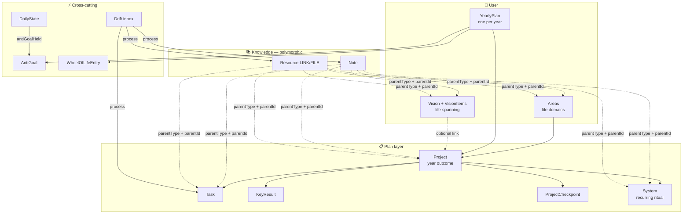
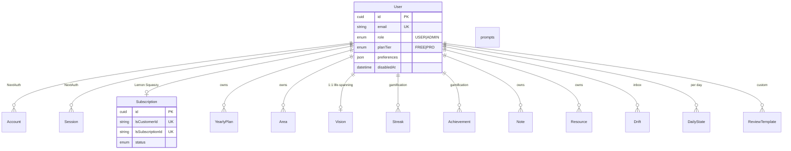
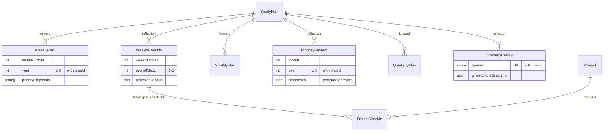
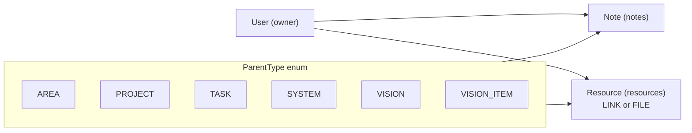
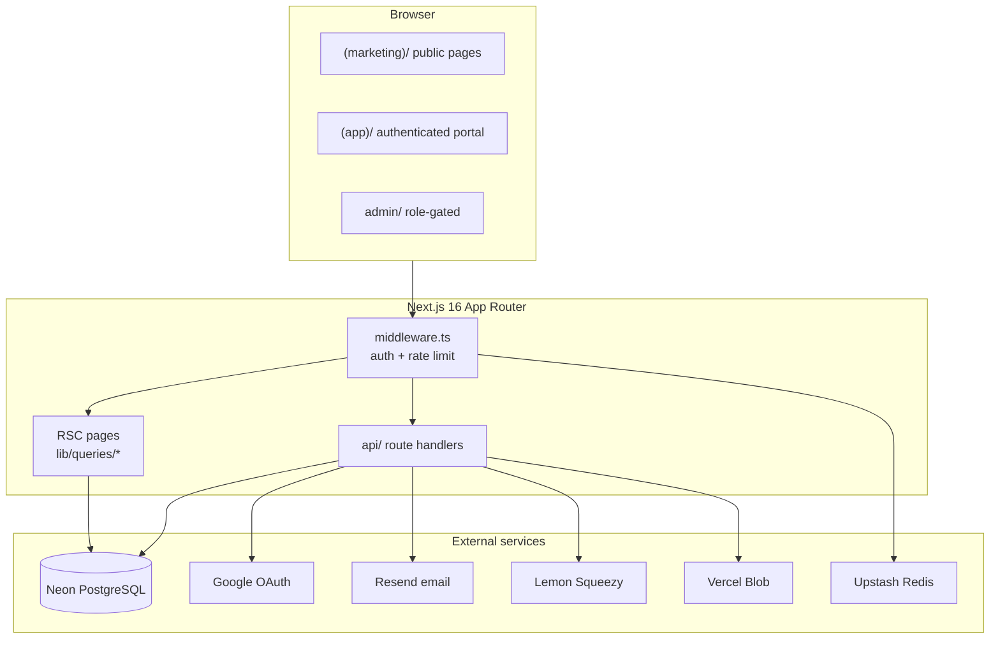
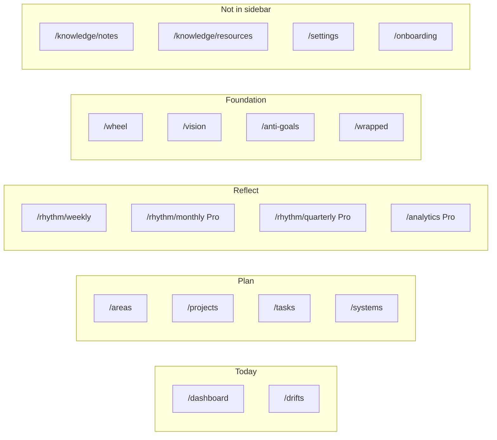

# YearInReview — project diagrams

Copy any section below into your notes app (Notion, Obsidian, Apple Notes via screenshot, etc.).  
All diagrams use [Mermaid](https://mermaid.live) — paste into [mermaid.live](https://mermaid.live) to export PNG/SVG.

**Legend:** `ModelName` = Prisma model · `(table_name)` = PostgreSQL table when different.

---

## 1. One-page cheat sheet

```
┌─────────────────────────────────────────────────────────────────┐
│  YEARINREVIEW — PARA year planner (yearinreview.online)         │
├─────────────────────────────────────────────────────────────────┤
│  STACK     Next.js 16 · TS · Prisma 6 · Neon · NextAuth v5      │
│            Lemon Squeezy · Resend · Vercel Blob · Upstash Redis │
├─────────────────────────────────────────────────────────────────┤
│  PARA      Area → Project → Task / KeyResult / Checkpoint /     │
│            System · Note & Resource attach anywhere             │
├─────────────────────────────────────────────────────────────────┤
│  ANCHORS   Vision (life-spanning) · Wheel · Anti-goals          │
│            YearlyPlan (per calendar year)                       │
├─────────────────────────────────────────────────────────────────┤
│  RHYTHM    Weekly plan+review → Monthly (Pro) → Quarterly (Pro) │
│            DailyState (mood/energy) · Drift inbox (⌘K)          │
├─────────────────────────────────────────────────────────────────┤
│  TIERS     Free: 3 projects · Pro: 20 projects + depth features │
└─────────────────────────────────────────────────────────────────┘
```

---

## 2. PARA hierarchy (conceptual)



---

## 3. Identity & billing ER



---

## 4. Foundation & projects ER

```mermaid
erDiagram
  YearlyPlan ||--o{ Project : "table: goals"
  YearlyPlan ||--o{ AntiGoal : boundaries
  YearlyPlan ||--o{ WheelOfLifeEntry : snapshots
  Area ||--o{ Project : optional
  Vision ||--o{ VisionItem : board cards
  Area ||--o{ VisionItem : optional anchor
  VisionItem ||--o{ Project : visionItemId
  Project ||--o{ Task : "table: actions"
  Project ||--o{ KeyResult : measurable
  Project ||--o{ ProjectCheckpoint : "table: checkpoint_goals"
  Project ||--o{ System : "table: daily_systems"
  Project ||--o| Motivation : why/consequence
  Project ||--o{ ProjectCheckIn : weekly per-project

  YearlyPlan {
    int year
    enum status "DRAFT|ACTIVE|COMPLETED|ARCHIVED"
    json reflections "theme etc"
  }

  Area {
    string name
    enum category "LifeCategory hint"
    bool isDefault
  }

  Project {
    enum category LifeCategory
    enum type "PRIMARY|SECONDARY"
    enum status GoalStatus
    string title
  }

  Vision {
    text northStar
  }
```

---

## 5. Execution ER

```mermaid
erDiagram
  Project ||--o{ Task : one-off work
  Project ||--o{ System : recurring
  System ||--o{ SystemCompletion : "unique per date"

  Task {
    enum type "SMALL|MEDIUM|BIG"
    enum status GoalStatus
    text description
  }

  KeyResult {
    float currentValue
    float targetValue
    string unit
  }

  ProjectCheckpoint {
    enum quarter "Q1-Q4"
    enum status GoalStatus
  }

  System {
    enum frequency "DAILY|WEEKLY|MONTHLY"
    bool isActive
  }

  SystemCompletion {
    date date UK "with systemId"
  }
```

---

## 6. Rhythm ER (plan + review pairs)



---

## 7. Polymorphic knowledge (Note + Resource)

Notes and resources are **not FK-linked** — they use `(parentType, parentId)`:



| Model | Table | Free cap | Pro cap |
|-------|-------|----------|---------|
| Note | `notes` | — | — |
| Resource LINK | `resources` | 10 total | 200 |
| Resource FILE | `resources` | — | 2 GB blob |

---

## 8. Daily loop & meta ER

```mermaid
erDiagram
  User ||--o{ DailyState : "unique userId+date"
  AntiGoal ||--o{ DailyState : "antiGoalHeldId"
  YearlyPlan ||--o{ AntiGoal : per year
  User ||--o{ Drift : "⌘K capture"
  User ||--o{ Streak : "WEEKLY_CHECK_IN | DAILY_SYSTEM"

  DailyState {
    date date UK
    int mood "1-5"
    int energy "1-5"
    text intention
    text reflection
    bool antiGoalHeld
  }

  Drift {
    enum kind "THOUGHT|TASK|NOTE|..."
    datetime resolvedAt
    string resolvedRef "promoted entity id"
  }

  Streak {
    enum type StreakType
    int currentStreak
    int longestStreak
  }
```

---

## 9. App architecture



---

## 10. Navigation map (4 intents → 11 routes)



---

## 11. Schema file map

| File | Domain | Models |
|------|--------|--------|
| `00-base.prisma` | Enums | Role, PlanTier, ParentType, … |
| `10-identity.prisma` | Auth & billing | User, Account, Session, Subscription |
| `20-foundation.prisma` | Year structure | YearlyPlan, Area, Vision, VisionItem, Wheel, AntiGoal |
| `30-projects.prisma` | PARA projects | Project, KeyResult, ProjectCheckpoint, Motivation |
| `40-execution.prisma` | Doing | Task, System, SystemCompletion |
| `50-rhythm.prisma` | Cadence | Weekly/Monthly/Quarterly Plan+Review, ReviewTemplate |
| `60-knowledge.prisma` | Notes & files | Note, Resource |
| `70-system.prisma` | Meta | Streak, Achievement, Drift, DailyState |

---

## 12. Legacy table names (important!)

Prisma model names use PARA vocabulary; PostgreSQL tables keep legacy names:

| Prisma model | DB table | Legacy FK column |
|--------------|----------|------------------|
| Project | `goals` | — |
| Task | `actions` | `goalId` → project |
| System | `daily_systems` | `goalId` → project |
| ProjectCheckpoint | `checkpoint_goals` | `goalId` |
| KeyResult | `key_results` | `goalId` |
| Motivation | `motivations` | `goalId` |
| ProjectCheckIn | `goal_check_ins` | `goalId` |

API redirects: `/api/goals/*` → `/api/projects/*` · pages: `/goals` → `/projects`.

---

## Export tips

1. **PNG/SVG:** Paste any `mermaid` block into [mermaid.live](https://mermaid.live) → Actions → Export.
2. **Obsidian:** Paste directly — Mermaid renders natively.
3. **Notion:** Use `/code` block, set language to Mermaid (or paste image export).
4. **Apple Notes:** Export PNG from mermaid.live and attach.

**Related docs:** [`PARA.md`](./PARA.md) · [`VISION.md`](./VISION.md) · [`ARCHITECTURE.md`](./ARCHITECTURE.md)
